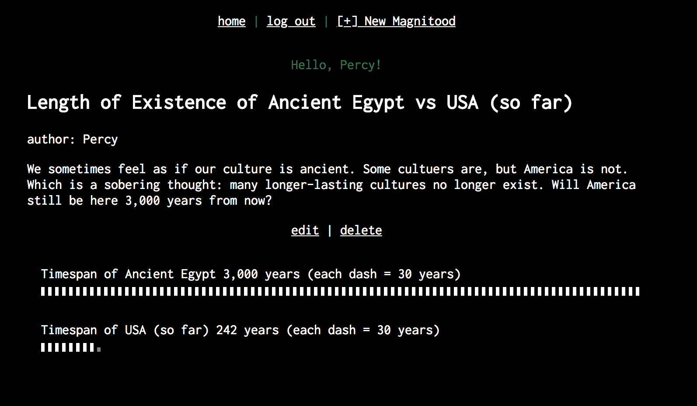

# magnitoodz

## About

Magnitooz is a web app for making comparisons. This is pre-alpha code.

It's inspired by Carl Sagon's Cosmic Calendar, which entralled me in my youth and gave me a viscerl undestanding of the age of the Universe.

Magnitooz allows users to create comparisons (visualied as line charts) and view the ones they and other users have created.

[Here is a detailed TODO list.](notes/01_TODO.md)

## Tech stack

- postgres
- knex
- node/express
- react
- redux
- react-router
- recompose
- ava (unit tests)

## Installation

- install [postgresql](https://www.postgresql.org/download/)
- `./setup.sh`

## Local development

In three terminal windows:

1. `npm run build:frontend:dev`
2. `npm run build:backend:dev`
3. `npm start:backend:dev`

## Testing

`npm run test`

## Notes

VSCode displays some annoying error message unless this is added to its user settings: `"typescript.tsdk": "node_modules/typescript/lib"`

## Project status

As you can see, the "artwork" and "design" is just roughed in. The dev work has been focused on the back-end and front-end utilties--especially ones connected to animation[1].

Before finalizing a front-end design, I need to pin down the display of large-difference comparisons, like the jellyfish one, above.

It's more confusing in a still than in the app, where it's animated. But it's still confusing.

This is a hard problem: it's easy to visually compare two values that are relatively close to each other, but when one is a tiny fraction of another, there's no way to keep the units for both the same and fit them on screen.

I'm looking at various solutions using 3D and/or animation that allows users to zoom in and out. Stay tuned.

---

[1] After doing a lot of research, I've concluded that there's no 3rd-party library (or at least no well-known one) that facilitates sequence animations in react. The react animation libraries that exist are focused on UI animation. But if you want to simply animate a series of visuals, one after the other, there's no simple method.

You can do this with CSS, but not if the animations are data driven. d3 might be a solution, but it's less about sequences and more about data visualizations.

My solution has been to cobble something together that makes GSAP (the most popular web-animation framework) play nice with react. I have a prototype (which is being used in this app), but it's tightly coupled with this particular use case.

I will spin it off from this project and generalize it. This seems so obviously useful that I'm amazed it doesn't already exist.
